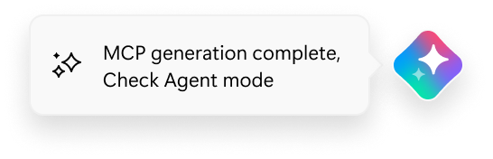
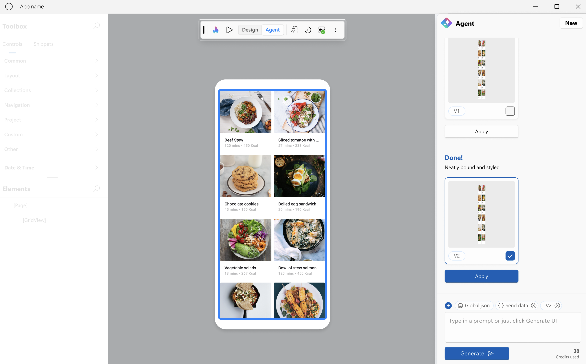

# Hot Design® Agent Overview

[!include[hd-important-info](includes/hd-important-info.md)]

The Hot Design® Agent is an AI-powered assistant that enables rapid **UX/UI creation and enhancement** within your application. It leverages data contexts and live previews to help developers **design**, **refine**, and **interact with user interfaces in real time**, using deep knowledge of Uno Platform and your running app to simplify cross-platform .NET design.

Available in Visual Studio 2022/2026, VS Code, Rider, and CLI Agents (e.g., Codex, Claude), Hot Design® Agent provides a unified human–AI design environment that adapts to your workflow. All actions are transparent, reversible, and run within your preferred IDE for full developer control.

> [!IMPORTANT]
> If you are new to Hot Design and would like to learn more about its features and how to set it up, go to the [Hot Design® Overview](xref:Uno.HotDesign.Overview) page.

## Working with Hot Design® Agent

To start using Hot Design® Agent, open Hot Design and from the toolbar toggle to **Agent** mode. This will open the Agent pane and allow you to start interacting with the agent.

### Generating UI

By default, the agent will use the current full data context to generate UI elements; however, you can choose to use one with only data types and no user data, or remove it completely. Once you have determined which data context to use, enter an optional prompt to start generating the UI (e.g., *"Create a gallery for pictures."*).

UI can be generated for an existing screen or a new one. At any time, you can choose to start over by pressing the **New** button.

Keep in mind that the generation may take some time depending on the complexity of the data context and the prompt. During this time, you can return to **Design** mode to continue working on other screens; you will be notified when the generation process is finished.

  

When the generation is complete, the result is displayed in the Agent pane. From there, you can:

1. **Apply the newly created design**: When your design is ready, click **Apply** to generate and apply the XAML to your application.
2. **Continue iterating on the proposed design**: Select the design you want to modify and make your changes.
3. **Return to a previous version for further refinement**: Choose an earlier version and adjust as needed.
4. **Start a new design**: Deselect all designs or click **New** to begin fresh.

After applying your design, you’re not done yet! You can either return to **Design Mode** to explore and refine it further, or click  **Play** to switch to **Interactive Mode** and test the newly generated design in action. This ensures your design isn’t just static—you can interact with it, validate its behavior, and make adjustments as needed.

