# Canvas

The **Canvas** is the central design surface where you build and interact with your running app's user interface. It reflects the live visual output of your XAML page and allows you to select, move, edit, and organize controls directly. Actions you take on the Canvas are reflected in real time, making it the most visual and interactive part of **Hot Design**.

Whether you're adjusting layout, editing a `UserControl`, or testing structure with live feedback, the Canvas helps you work faster and more intuitively.

The Canvas shows your running app in **Application** mode. Switching to **Previews** mode on the left navigation bar shows your [previews](xref:Uno.HotDesign.Previews) on the same surface instead.

## Zoom, Scroll, and Pan

### Zoom

To zoom in or out of the **Canvas**:

- **Mouse**: Hold `Ctrl` (or `Cmd` on macOS) and scroll with your mouse wheel. The point under the cursor stays put as the canvas scales.
- **Keyboard**: Press `Ctrl +` / `Ctrl -` (or `Cmd +` / `Cmd -` on macOS) to zoom in or out in steps of 20 percentage points.

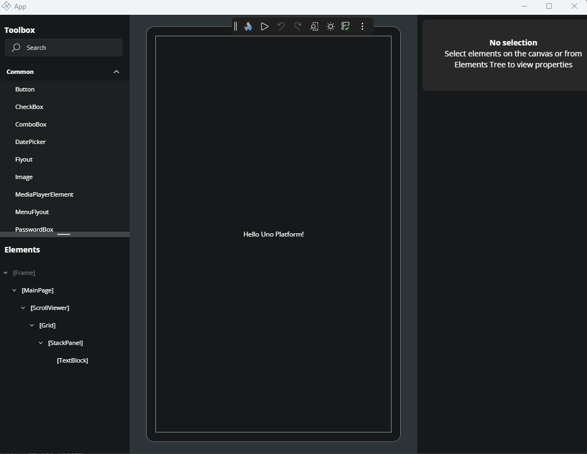

Zoom is clamped to a range of **20% to 340%**. Setting a zoom level by any means — the slider, the percentage box, a preset, or `Ctrl` + wheel — turns **Auto-Fit** off. With Auto-Fit on, the zoom is computed so the whole design surface fits the visible canvas area, and the effective percentage is displayed even when it falls outside the manual range.

### Scroll and Pan

To move around the **Canvas** area:

- Scroll vertically using your mouse wheel.
- Scroll horizontally by holding `Shift` while using the mouse wheel.
- Pan in any direction by pressing the **middle mouse button** and dragging.

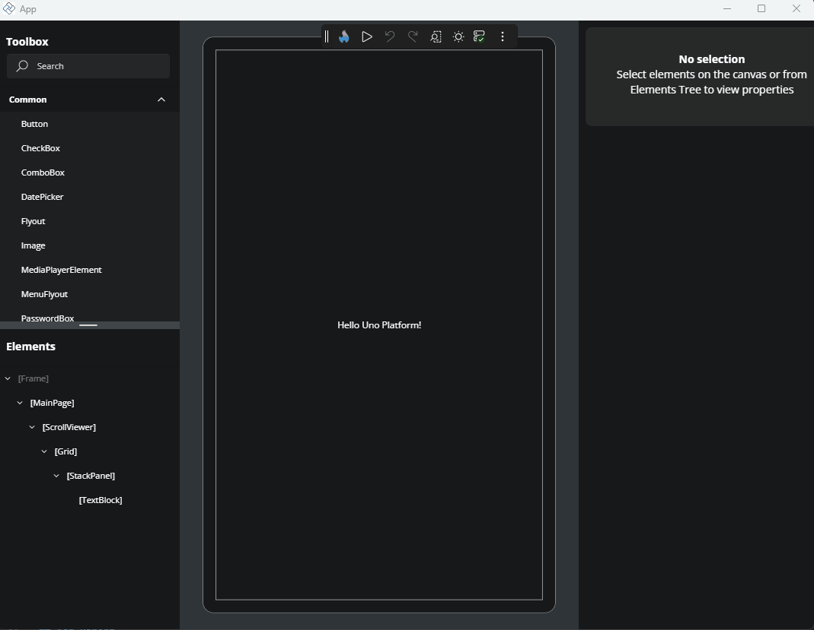

Overlay scrollbars appear when the zoomed design surface is larger than the visible canvas area, and are disabled when everything fits.

## Resize the Design Surface

A **resize gripper** sits on each of the four edges of the device frame. Hovering a left or right gripper shows a west-east resize cursor; hovering a top or bottom gripper shows a north-south cursor.

Drag a gripper to resize the design surface continuously — the side grippers change the width only, the top and bottom grippers the height only. Drags map 1:1 to canvas pixels regardless of zoom, so a 10 px pointer move changes the canvas by 5 px at 200% zoom and by 20 px at 50%.

Starting a drag turns **Auto-Fit** off so the resize is not immediately re-fitted. Completing one switches the form factor to **User defined size** (Custom) and remembers the resulting dimensions, so switching to a preset and back to Custom restores them — including after restarting your app.

<!-- TODO(image): Screenshot of the design surface with the four edge resize grippers highlighted, and the west-east resize cursor shown on the right-hand gripper mid-drag. -->

> [!NOTE]
> Grippers are hidden while you are viewing a preview — resizing the application surface is not something a preview honours.

## Select Elements on the Canvas

To select a control or layout element, click it directly on the **Canvas**. The top-most selectable element under the pointer is chosen, and highlighted with a blue border known as a **visual adorner**.

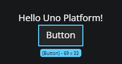

- Clicking an element that is **already selected** keeps it selected in preference to others under the pointer.
- Hold `Alt` and click to pick a **parent**. The first click selects the element under the pointer; each further click steps one level outward through its parents, crossing into the surrounding user controls and templates as it goes, and the step after the outermost returns to where you started. Keep clicking until the outline is around what you meant — overshooting costs one more click, not a restart. While you cycle, the element the gesture has reached is drawn with the **selection** outline rather than the hover one, so it is easy to tell apart from whatever the pointer happens to be over.
- Press `Esc` to clear the selection. With nothing selected, `Esc` steps out of the editor you are in, so pressing it repeatedly walks back out of a nested drill-in.
- The **middle mouse button** never changes the selection — it is reserved for panning.
- Regions with no selectable element — generated template content with no XAML identity, for example — leave the selection unchanged.

Your selection is re-established on the replacement element after a Hot Reload, so you do not have to re-select after a code change.

### Select Multiple Elements

Hold `Ctrl` (or `Cmd` on macOS) and click additional elements to select them together. This is useful for applying shared properties or moving groups of elements.

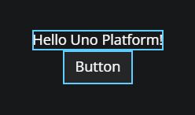

### Hover Feedback

Moving the pointer over a selectable element draws a thin **hover outline** around it, so you can see what a click would select before you commit. That is the only outline hover draws — including over an item generated from a `DataTemplate`, where clicking already opens the item's template.

Hover feedback is suppressed while a drag is in progress, and removed when the pointer leaves the canvas.

## Visual Adorner Details

When a single element is selected, a solid outline (the *visual adorner*) appears around it, showing:

- The control's name (e.g., `Button`, `TextBlock`)
- The control's size in pixels (width × height)
- The element's **margin and padding**, drawn as bands around and inside the outline

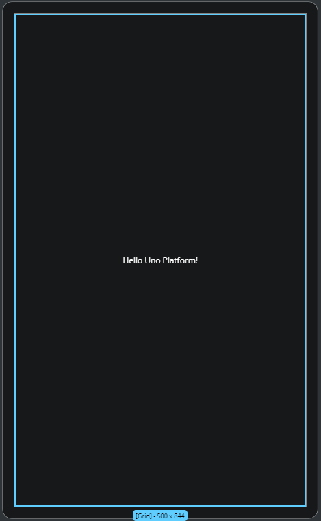

Hovering a side of a margin or padding band shows that side's value (for example **16 Padding**), so you can read the spacing without opening the **Properties** panel.

### Adjust Spacing and Size by Dragging

> [!NOTE]
> Editing layout by dragging on the canvas is a preview feature and is off by default. Enable it for your application by adding `[assembly: PreviewFeature(PreviewFeature.CanvasDragEditing)]` (from `Uno.UI.HotDesign.Client.Logic.AppFeatures`), the same way other preview features are opted into. While it is off, a selected element still shows its outline and its margin/padding bands, but nothing on the canvas can be dragged to edit those values.

You can change these values on the canvas instead of typing them into the **Properties** panel. Select an element and drag:

- a **margin** or **padding** area to change that side's value
- the **spacing** guide between a container's children to change its `Spacing`, `RowSpacing` or `ColumnSpacing`
- the element's **edge** to change its `Width` or `Height`
- a **corner** to change the `Width` and `Height` together — hold **Shift** while dragging a corner to keep the element's proportions
- the **border** gripper, at the middle of that edge, to change its `BorderThickness`

When the pointer moves over one of these areas a small marker appears at its middle, showing where to grab it; it stays hidden otherwise so a selected element is not covered in markers. An area is a fixed size on screen, so it stays the same target at any zoom level and at any value — including zero, so you can introduce a margin, padding or spacing that is not there yet. A margin area sits outside the element and a padding area inside it, so the two are never confused, and the rest of each band stays available for selecting whatever lies underneath. A corner shows a diagonal resize cursor and is offered only when the element is large enough to resize on both axes.

The element responds as you drag, so you can see the layout settle; your XAML is written once when you release, giving one change to undo — a corner drag writes its width and height together, so undoing it returns both. Values step in fours — `0`, `1`, `2`, `4`, `8`, `12` and so on — because layout values usually want to be multiples of four; hold **Shift** to move a pixel at a time (on a corner, **Shift** locks the aspect ratio instead). A badge beside the pointer shows the value and which property you are changing, or `Width × Height` while resizing from a corner.

Press **Esc** mid-drag to abandon it: the element returns to the value it started at and nothing is written. If a change cannot be written, the element is put back and you are told, so the canvas never shows a value your source does not have.

> [!NOTE]
> Resizing an element whose size its container was deciding sets the size explicitly, so the element stops sizing itself to that container. Hot Design tells you when this happens, because nothing else on the canvas would show it.

When **two or more** elements are selected, each is drawn with an outline only — no label and no margin/padding bands.

Adorners follow the element they decorate: they track its rendered bounds as it moves, resizes, or the canvas zoom changes.

### Layout Guides for Containers

Some containers get affordances specific to them:

- **`Grid`** — dashed separator lines between rows and columns when spacing is zero, spacing indicators where row or column spacing is greater than zero, and a highlight over the usable content area inside the `Grid`'s padding.
- **`StackPanel`** — dashed separators between children when spacing is zero, and spacing indicators between them when it is not. A guide appears between each pair of **visible** children: a collapsed child takes up no space in the panel, so no gap is shown for it.
- **`SwipeControl`** — **Swipe Left** / **Swipe Right** buttons, so you can preview the swipe states without a touch gesture.

Any control with no specific adorner still gets the default outline.

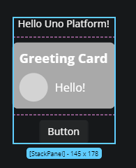

## Rearranging Elements with Drag and Drop

You can reposition controls directly in the layout:

1. Click and hold an element.
2. Drag it to a new location on the **Canvas**.
3. Release to drop it.

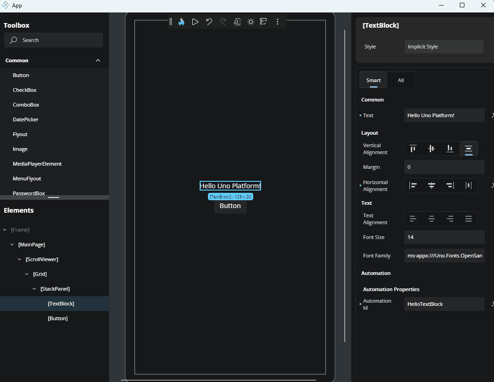

While dragging, a preview outline shows where the element will land and the prospective drop container is outlined with its margin and padding shown. Dropping in a new container or position moves the element in the underlying XAML and confirms the change; dropping it back where it started makes no edit at all. When the pointer is over a region with no valid drop container, the cursor indicates that dropping is not possible there.

A few details:

- Small, involuntary pointer movements do not start a drag — releasing performs a normal selection click instead.
- Holding `Ctrl` while dragging **copies** the element: a new copy of its XAML is inserted at the drop position and the original stays in place.
- An element that is not editable in XAML — one with no XAML source position, or presented content — cannot be dragged.

## Wrap an Element with a Parent Container

To surround an existing element with a new layout container:

1. Right-click the element.
2. Choose **Add parent**.
3. Select a parent control: `Border`, `Canvas`, `Grid`, `RelativePanel`, `ScrollViewer`, `StackPanel`, or `Viewbox`.

The new parent will be added to the visual tree and reflected on the **Canvas**.

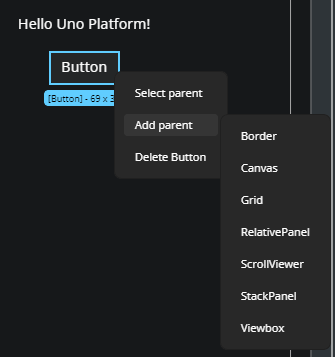

## Select an Element's Parent

If you're trying to select a layout container of a specific control:

1. Right-click the child element.
2. Choose **Select parent** from the context menu — or press `Shift + Enter`.

This selects the parent element on both the **Canvas** and in the **Elements** panel.

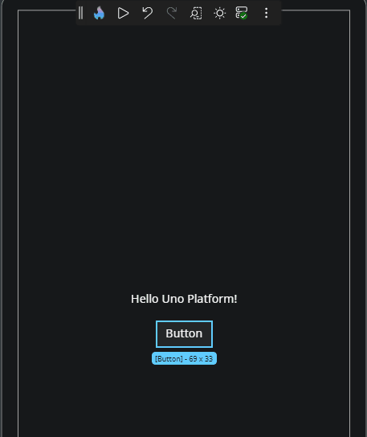

## Delete an Element

To remove a control from the **Canvas**:

1. Right-click the element.
2. Choose **Delete [ControlName]** from the menu (e.g., **Delete Button**).

Or select one or more elements and press `Delete`.

The element will be removed from both the **Canvas** and the **Elements** panel.

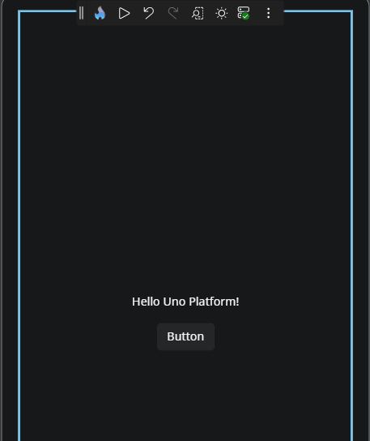

## The Context Menu

Right-clicking a selectable element opens a context menu for the element under the pointer — an already-selected element under the pointer takes precedence. The menu offers the actions that apply to that element: **Delete** (when the element is editable in XAML), **Add parent**, **Select parent**, **Edit \<UserControl>**, and **Edit \[\<template property>]** for an element inside a data template.

Holding `Ctrl + Shift` while right-clicking adds advanced entries to the standard ones.

Right-clicking never starts an accidental drag — the pointer and drag state are reset when the menu opens. It also never changes what is selected and never opens a scope: right-clicking an element that belongs to a deeper scope leaves the canvas where it is rather than drilling into it first.

## Double-Click Actions

Double-clicking on the canvas navigates the editing context:

| Double-click on | Result |
| --- | --- |
| An item generated from a `DataTemplate` | Opens that template in the [Template Editor](xref:Uno.HotDesign.Properties.TemplateEditor) |
| A `UserControl` belonging to your project | Opens it in its own editing scope |
| An area outside the current editor's content | Closes the current editor and returns to the parent scope |

Holding `Alt` suppresses all of these. Two `Alt` + clicks in quick succession are a step through the
parent chain, not a request to open an editor, so they never navigate by accident.

## Edit a UserControl from the Canvas

A `UserControl` is a reusable component that encapsulates a set of UI elements and their associated behavior. It's commonly used to organize parts of your interface into self-contained, maintainable units that can be reused across different parts of your application.

If your layout includes a `UserControl`, you can open it directly from the **Canvas** for editing:

1. Right-click the `UserControl`.
2. Choose **Edit [UserControlName]** — or double-click it, or press `Ctrl + Shift + U` with it selected.

This opens the editor for the `UserControl`, allowing you to modify its internal structure or layout. To return to your previous page edition, click the `../` back icon in the top-left corner of the interface or the **Elements** panel.

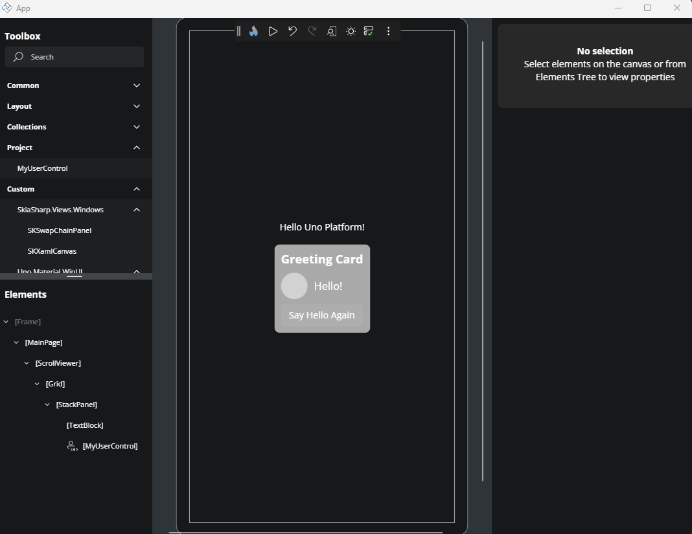

When you close a `UserControl` editor, **every live instance** of that `UserControl` is refreshed — not just the one you were editing — so your change is visible everywhere it is used. Closing an editor in which you changed nothing runs no refresh at all.

## Edit Flyouts from the Canvas

You can edit flyouts in Hot Design in two main ways.

### Using the Property Window

You can locate the `Flyout` property in the **Property Window** and edit it using the **Complex Type Editor**. To learn more about how the Complex Type Editor works, refer to the [Complex Type Editor documentation](xref:Uno.HotDesign.Properties.Editors#complex-types).

### Using the Flyout Editor

The **Flyout Editor** allows you to edit the contents of the flyout directly. You can add, remove, or modify individual elements inside the flyout.
To open the Flyout Editor, follow these steps:

1. In the **Toolbar**, click the **More Options** button (three dots).
2. Hover over the **Window** menu and uncheck the option **Show tools in-app**.
   This will move the Toolbox, Elements window, and Property window to external windows, leaving only the Canvas in the main window.
3. Enable **Interactive Mode** by clicking the **Play** button in the toolbar.
4. Perform the action that opens the flyout (e.g., click the button that has a flyout).
5. With the flyout still opened, disable **Interactive Mode** by clicking the **Pause** button in the Toolbar.
   This will activate the **Flyout Editor**.

Now you can freely make any changes to the flyout.

To exit the **Flyout Editor**, you can:

- Click the **Enter Interactive Mode** button in the Toolbar (Play icon)
- Or click the **Back** icon in the top-left corner of the **Canvas** or **Tree window**

> [!NOTE]
> In external tool windows, zoom features are disabled. This means you won't be able to adjust form factor, zoom, or scroll while editing a Flyout.
> [!TIP]
> **UserControl** and **DataTemplate** editors are fully supported inside the Flyout Editor, so you can edit them directly within the Flyout context.
> [!IMPORTANT]
> Editing *nested flyouts* is not supported at the moment.

## The Device Frame and Canvas Appearance

The design surface is wrapped in a **device frame** whose chrome matches the selected form factor: the phone-class form factors (**Narrowest** and **Narrow**) show a small-device bezel, and every other form factor shows the larger-device frame. The frame is not shown while a nested template editor is open.

The area around the frame is filled with the designer canvas color — `#ECEDEE` in light theme and `#2E3438` in dark. There is no checkered background pattern.

Application content that paints outside its layout bounds — a full-screen background or a particle effect, say — is clipped at the design surface boundary, so it never renders over the device frame chrome. The clip follows the application area as the frame is resized or the form factor changes.

A fixed inset is kept between the design surface and the edge of the canvas viewport, with extra space at the bottom while a preview is open so content never renders under the **Edit** overlay button.

## Rulers and Guides

> [!NOTE]
> The rulers and the crosshair are preview features and are off by default. Enable them for your
> application by adding `[assembly: PreviewFeature(PreviewFeature.CanvasRulers)]` and
> `[assembly: PreviewFeature(PreviewFeature.CanvasCrosshair)]` (from
> `Uno.UI.HotDesign.Client.Logic.AppFeatures`), the same way other preview features are opted into.
> The crosshair needs the rulers: on its own it is not offered. While a feature is off, its entry is
> absent from the **Windows** menu and its shortcut does nothing.

The canvas is framed by **rulers** — one along the top, one down the left. Press `Ctrl + R` to turn them
off, or back on; the same toggle sits in **More** (⋯) > **Windows** > **Rulers & Guides**. Your choice is
remembered, so if you turn them off they stay off next time you open Hot Design.

Position `0` on each ruler lines up with the top-left corner of the screen you are designing, so a
value on a ruler is the coordinate your XAML would use. Values to the left of, or above, that corner
read as negative. The rulers follow the canvas as you zoom and pan, and the spacing between labelled
marks adapts so the numbers never run together.

**Where the pointer is.** The crosshair is off to begin with. Press `Ctrl + Shift + R` — or use
**More** (⋯) > **Windows** > **Crosshair** — for a crosshair that follows the pointer across the canvas. With the rulers on, each ruler shows the
coordinate under the pointer beside the crosshair line.

The crosshair and the rulers are separate toggles, and each is remembered on its own. Turn the
crosshair on by itself to line two elements up by eye without giving up canvas space to the rulers, or
turn the rulers on by themselves if you would rather nothing followed the pointer.

**Where the selection is.** Selecting an element bands its extent on both rulers and calls out the
start and end values, so you can read an element's position and size straight off the ruler. A
labelled mark that would collide with one of those values is hidden while it does.

**Guides** are reference lines you place yourself:

- **Add one** by pressing on a ruler and dragging onto the canvas. A plain click on a ruler leaves
  nothing behind.
- **Move one** by dragging it. A guide runs the full width or height of the canvas, across its ruler,
  and can be grabbed anywhere along it; the ruler shows its position as you drag.
- **Delete one** by dragging it onto the ruler it came from and releasing it there — over the ruler
  strip itself, not just near it. Releasing anywhere else moves the guide instead. Pressing and
  releasing on the stretch of guide drawn across the ruler counts as a click, not a deletion, so a
  stray click cannot remove one. `Delete` always acts on the selected element, never on a guide.
- **Clear them all** from the ruler's own context menu — right-click either ruler for
  **Hide Rulers & Guides** and **Clear All Guides**.

**How far apart things are.** With two or more guides on the same axis, the distance between each
adjacent pair is shown on the canvas beside that axis' ruler, on an arrow spanning the gap it measures,
in the same units the rulers use. Drag a guide and the distances follow it. A gap too narrow for the
number to fit is left unlabelled — zoom in and it appears.

Each guide's own position is shown on its ruler at all times, so you can read where every guide is
without touching any of them. A guide turns the highlight colour while you drag it and returns to the
guide colour when you let go.

**Measuring from a point.** With the crosshair on, hold `Shift` to leave a second crosshair where the
pointer is; as you move, the horizontal and vertical distances from that point are shown on arrows
spanning them. Release `Shift` to finish. The anchor stays on the canvas position you placed it on, so you can
pan or zoom mid-measurement. Measuring is a hover gesture: while you are dragging something — resizing
an element, panning, moving a guide — `Shift` keeps its usual meaning for that drag and no measurement
is placed.

Guides last for the session rather than being saved with your project, and they are discarded when you
open a different screen, since a position only means something against the screen it was placed on. The
ruler and crosshair toggles *are* remembered; the guides are not.

> [!NOTE]
> The rulers are not drawn while **Interactive** mode is on — the canvas belongs to your running
> application then, and a strip along its edges would swallow taps meant for your app.

## Interactive Mode

Hot Design's **Selection / Interactive** toggle decides whether canvas clicks select elements or drive your running app.

Turning **Interactive** on (from the toolbar, or with `Ctrl + Shift + I`) passes pointer input straight through to your application: buttons work, navigation works, animations run. Selection chrome is hidden, the current selection is cleared, and any open nested editors are closed first. Turning it off rebuilds the element hierarchy so the design surface reflects wherever you navigated to, and selection resumes.

> [!NOTE]
> While the toggle is on, the **Toolbox**, **Elements**, and **Properties** panels are covered by a dimming overlay — the canvas and the top toolbar stay interactive. Tapping a covered panel returns you to selection mode.

The toggle is not available on the [previews](xref:Uno.HotDesign.Previews) canvas, which has its own interaction handling.

If your page still carries design-time data, turning Interactive on asks you to confirm first.

## Keyboard Shortcuts

The canvas responds to the shortcuts listed in full on the [Shortcuts](xref:Uno.HotDesign.Shortcuts) page. The ones you will reach for most:

| Action | Shortcut |
| --- | --- |
| Delete the selection | `Delete` |
| Select the parent element | `Shift + Enter` |
| Edit the selected `UserControl` | `Ctrl + Shift + U` |
| Undo / redo | `Ctrl + Z` / `Ctrl + Y` |
| Fit content to the canvas | `Ctrl + 0` |
| Zoom to 100% / 200% / 300% | `Ctrl + 1` / `2` / `3` |
| Toggle Auto-Fit | `Ctrl + 9` |
| Toggle Interactive mode | `Ctrl + Shift + I` |
| Show or hide the rulers and guides | `Ctrl + R` |
| Show or hide the crosshair | `Ctrl + Shift + R` |
| Measure from a point (crosshair on) | Hold `Shift` |

## Helpful Notifications

While designing on the Canvas, notifications may appear:

- When changes are applied, a loading indicator may display briefly. Changes that need the running app to be rebuilt show an **Updating App** overlay while a Hot Reload runs.
- If an error occurs (e.g., invalid XAML), an error notification appears in the bottom-right corner.

These notifications help you track changes and issues in real time.

## Next Step

- [Properties](xref:Uno.HotDesign.Properties)
