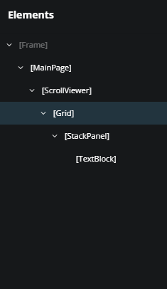
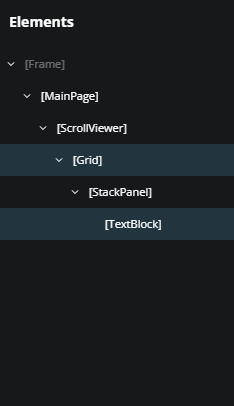
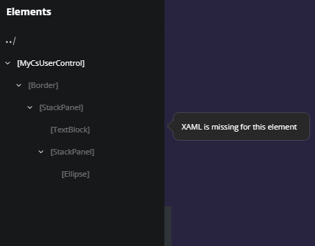

# Elements

The **Elements** panel gives you a hierarchical view of your app’s user interface. It reflects the XAML visual tree and shows how controls are nested and organized on the current page. You can use it to select elements, change layout structure, wrap items in containers, or quickly jump between components, making it easier to manage complex UIs during live design.

Whether you're organizing layout containers, editing a UserControl, or deleting an unused element, the Elements panel gives you precise control over your app’s structure.

## Select Elements in the Visual Tree

Click an element in the visual tree to select it. The selected element also highlights in the **Canvas** so you can see where it is.

### Select Multiple Elements

Hold `Ctrl` (or `Cmd` on macOS) and click multiple items to select them together. This is helpful when applying the same property changes to multiple elements.

## Rearrange Elements with Drag and Drop

To move an element:

1. Click and drag it within the visual tree in the **Elements** panel.
2. Drop it where you want it, either within the same parent or under a different one.

You can:

- Reorder elements within the same container

  

- Move an element to a new parent, such as placing a `Button` inside another `StackPanel`

  

## Expand and Collapse Containers

Panel elements like `Grid`, `Border`, and `StackPanel` can contain child elements. In the visual tree, these appear as expandable nodes having multiple children.

Content controls like `Border` or `Viewbox` can have only one child.

Use the arrow next to a node to collapse or expand it. This helps reduce visual clutter and focus on the part you're actively editing.

## Wrap an Element with a New Parent

To nest an element inside a new container:

1. Right-click the element.
2. Choose **Add parent**.
3. Select a layout control (e.g., `StackPanel`, `Grid`) from the list.

This places the selected element inside the new parent and updates the visual tree accordingly.

## Jump to an Element’s Parent

To quickly select an element’s parent:

1. Right-click the child element.
2. Choose **Select parent**.

This selects the parent in both the **Elements** panel and the **Canvas**, helping you navigate complex trees.

## Delete an Element from the Visual Tree

To remove an element:

1. Right-click it.
2. Choose **Delete [ElementName]** (e.g., **Delete Button**).

The element is immediately removed from the layout and visual tree.

## Edit a UserControl from the Visual Tree

A `UserControl` is a reusable part of your app that groups UI elements and their behaviors. It is commonly used to organize parts of your interface into self-contained, maintainable units that can be reused across different parts of your application.

If your page includes a `UserControl`, you can edit it directly by:

- Clicking the pencil icon next to the `UserControl` in the visual tree.
- Or, right-clicking the node and choosing **Edit [UserControlName]**.

This opens the editor for the `UserControl`, allowing you to modify its internal structure or layout. To return to your previous page edition, click the `../` back icon in the top-left corner of the interface or the **Elements** panel.

## NavigationBar Command Collections

The `NavigationBar` control exposes two UI collections in the Elements panel:

- **PrimaryCommands**  
- **SecondaryCommands**  

### Hover & Add

1. **Hover** over either `PrimaryCommands` or `SecondaryCommands` in the tree and a **+** icon appears.

2. **Click the +** to open a lite, dismissible flyout listing all compatible element types (e.g. `AppBarButton`, `AppBarSeparator`, `AppBarToggleButton`):

   

3. **Select** a type to insert it at the end of the collection.

> **Tip**: if your collection already contains many items, the flyout will show a “Too many items” tip prompting you to drag from the Toolbox instead of scrolling through a very long list.

### Reorder & Remove

- **Reorder** by dragging the item up or down.

- **Remove** by selecting one or more command nodes and pressing **Delete**, or by right‑clicking and choosing **Delete**.

### Incompatible Drag‑and‑Drop

If you attempt to drag an element that isn’t valid for a NavigationBar command (for example, a `TextBlock`), you’ll see a “no‑drop” cursor and a teaching tip explaining why.

## Get Help from Teaching Tips

If an element can’t be edited, for example, if it was created entirely in C# with no associated XAML, hovering over it may display a **Teaching Tip**. They offer helpful tips and explain common restrictions.

## Next Step

- [Interactive Canvas](xref:Uno.HotDesign.Canvas)
