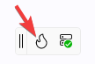

# Create a Counter App with Hot Design<sup>®</sup>

This tutorial will guide you through using Hot Design to create a simple counter application. The application will include:

- An `Image` at the top.
- A `TextBox` below the image, where you can set the step size for incrementing the counter.
- A `TextBlock` below the `TextBox`, displaying the current counter value.
- A `Button` at the bottom labeled **"Increment Counter by Step Size"**, which updates the counter value based on the step size entered.

<p align="center">
  
</p>

## Before You Begin

This tutorial uses the [XAML + MVUX variant](xref:Uno.Workshop.Counter.XAML.MVUX). You can switch to MVVM by using [this version](xref:Uno.Workshop.Counter.XAML.MVVM) if desired. Explore other tutorial variants [here](xref:Uno.Workshop.Counter).

Make sure:

- Your environment is [set up](xref:Uno.GetStarted)

- You're using **Uno.Sdk 6.0 or higher** (we recommend our newer versions to get the most out of the latest Hot Design features), by updating your project to the [latest **Uno.Sdk** version](https://www.nuget.org/packages/Uno.Sdk). For detailed steps, see our [migration guide](xref:Uno.Development.MigratingFromPreviousReleases).
  If you’re coming from **Uno.Sdk 5.4 or lower**, note that `EnableHotReload()` in *App.xaml.cs* has been deprecated. Replace it with `UseStudio()` to keep Hot Reload working.

- You're signed in with your Uno Platform account [(licensing steps)](xref:Uno.GetStarted.Licensing)

- You check [Hot Reload platform support](xref:Uno.Platform.Studio.HotReload.Overview) (Hot Design relies on **[Hot Reload](xref:Uno.Platform.Studio.HotReload.Overview)** for updates, so be sure to check the [current support for your OS, IDE, and target platforms](xref:Uno.Platform.Studio.HotReload.Overview#supported-features-per-os) before testing.)

> [!NOTE]
> Hot Design works independently of architectural patterns but this guide uses MVUX.

[!include[hd-important-info](includes/hd-important-info.md)]

## Creating the Counter Application

### [Visual Studio](#tab/vs)

- Launch **Visual Studio** and click on **Create new project** on the Start Window. Alternatively, if you're already in Visual Studio, click **New, Project** from the **File** menu.
- Type "Uno Platform" in the search box
- Click **Uno Platform App**, then **Next**
- Name the project `Counter` and click **Create**

At this point you'll enter the **Uno Platform Template Wizard**, giving you options to customize the generated application. For this tutorial, we're only going to configure the presentation framework.

- Select **Blank** in **Presets** selection
- Select the **Presentation** tab and choose **MVUX**
- Click **Create** to complete the wizard

The template will create a solution with a single cross-platform project, named `Counter`, ready to run.

### [Rider](#tab/rider)

- Launch **Rider** and click on **New Solution** on the Start Window
- From the left menu, under the **Uno Platform** section, select **Uno Platform App**

At this point, you'll see options for creating a new Uno app, allowing you to customize the generated application. For this tutorial, we will only configure the presentation framework.

- Name the project `Counter`
- Select **Blank** in **Presets** selection
- Select the **Presentation** tab and choose **MVUX**
- Click **Create** to complete the creation

The template will create a solution with a single cross-platform project, named `Counter`, ready to run.

### [VS Code](#tab/vscode)

- Launch The Live Wizard by clicking [here](https://new.platform.uno/)
- Name the project `Counter` and click **Start**
- Select **Blank** in **Presets** selection
- Select the **Presentation** tab and choose **MVUX**
- Click **Create** to complete the wizard
- Copy the `dotnet new` command and run it from a terminal where you want your solution to be located.
- This will create a new folder called **Counter** containing the new application.
- Next, open the project using Visual Studio Code. In the terminal type the following:

  ```bash
  code ./Counter
  ```

- Visual Studio Code might ask to restore the NuGet packages. Allow it to restore them if asked.
- Once the solution has been loaded, in the status bar at the bottom left of VS Code, `Counter.sln` is selected by default. Select `Counter.csproj` to load the project instead.


### [Command Line](#tab/cli)

Install the latest Uno Platform dotnet new templates by following [these instructions](https://aka.platform.uno/dotnet-new-templates).

From the command line, run the following command:

```dotnetcli
dotnet new unoapp -preset blank -presentation mvux -o Counter
```

This will create a new folder called **Counter** containing the new application.

---

## Assets

First, we need to add the image file to the application. Download this [SVG image](https://aka.platform.uno/counter-tutorial-svg-uno-logo) (Open this [link](https://aka.platform.uno/counter-tutorial-svg-uno-logo), right-click on the SVG image and select "Save as") and add it to the **Assets** folder. Once added, rebuild the application to ensure the image is included in the application package.

> [!NOTE]
> If you're working in Visual Studio, select the newly added **logo.svg** file in the **Solution Explorer**, open the **Properties** panel, and ensure the **Build Action** property is set to **`UnoImage`**. For other IDEs, no further action is required as the template automatically sets the **Build Action** to **`UnoImage`** for all files in the **Assets** folder.

For more information on **Uno.Resizetizer** functionalities, visit [Get Started with Uno.Resizetizer](xref:Uno.Resizetizer.GettingStarted).

## Run the app

**Hot Design** relies on [Hot Reload](xref:Uno.Platform.Studio.HotReload.Overview) for updates, so be sure to check the [current support for your OS, IDE, and target platforms](xref:Uno.Platform.Studio.HotReload.Overview#supported-features-per-os).

Before you run the application, switch the target platform to **Desktop** (`net9.0-desktop`) to enable Hot Design during debugging. For more information on how to switch the target platform, visit the documentation page for your IDE:

- [Visual Studio](xref:Uno.GettingStarted.CreateAnApp.VS2022#debug-the-app)
- [Rider](xref:Uno.GettingStarted.CreateAnApp.Rider#debug-the-app)
- [VS Code](xref:Uno.GettingStarted.CreateAnApp.VSCode#debug-the-app)
  > [!IMPORTANT]
  > In the status bar at the bottom left of VS Code, ensure `Counter.csproj` is selected (by default `Counter.sln` is selected).
  >
  > 

Now, let's run the app.

## Enter Hot Design Mode

To start editing the UI, enter **Hot Design** by clicking the **flame** button in the diagnostics overlay that appears over your app.

> [!NOTE]
> If you don't see the **Hot Design** flame button, ensure that you are [signed in with your Uno Platform Account](xref:Uno.GetStarted.Licensing) and using the [latest stable 6.0 Uno.Sdk version or higher](https://www.nuget.org/packages/Uno.Sdk). We recommend our newer versions to get the most out of the latest Hot Design features.
> For detailed steps, see our [migration guide](xref:Uno.Development.MigratingFromPreviousReleases).

<p align="center">
  
</p>

## Design the UI

When making changes via **Hot Design**, the XAML will automatically update to reflect your edits. Similarly, any changes made directly to the XAML will be reflected in Hot Design.

### Remove Existing Elements

1. Remove the existing `StackPanel`. In the **Elements** panel, select the `StackPanel`, right-click, and choose **Delete StackPanel**.

    

### Add a `StackPanel`

1. Let's add the container to hold our elements by adding a `StackPanel`. In the **Toolbox** panel, search for "StackPanel". Once it appears in the search results, drag it onto the **Canvas**.

    

    Alternatively, you can drag the element from the **Toolbox** and drop it onto the **Elements** panel.

    

    Another way would be to select the **existing element** in the **Elements** panel where you want to add a new item, then double-click the desired item in the **Toolbox** panel to add it as a child of the target.

    

1. Now, let's edit a property of the `StackPanel` to align it vertically and horizontally to the center. Select the `StackPanel` from the **Elements** panel or the **Canvas**. In the **Properties** panel, on the right side of the app, find the `VerticalAlignment` property and set it to **Center**, then do the same for `HorizontalAlignment`.

    

### Add an `Image` element

1. Next, add an `Image` element to the `StackPanel`. In the **Toolbox** panel, search for "Image". Once it appears in the results, drag it onto the `StackPanel` using either the **Canvas** or the **Elements** panel.

1. Now that the `Image` element is added, let's set the source for our `Image` element. In the **Properties** panel, locate the `Source` property. Start typing the name of the image we previously added, and the results should appear. Select **Assets/logo.png**.

    

1. Now, let's edit some properties to enhance its appearance. In the **Properties** panel, use the search button to find properties. Search for "Width" and set its value to **150**. Do the same for `Height`. Our `Image` element is now complete!

    

### Add a `TextBox` element

1. The next step is to add a `TextBox` that will hold the increasing step value for our Counter app. In the **Toolbox** panel, search for "TextBox." Once it appears in the results, drag it onto the `StackPanel`, making sure to place it under the `Image` element.
1. Now, let's set the `TextBox` properties. In the **Properties** panel, set the `PlaceholderText` to "Step Size" and set the `TextAlignment` to **Center**. Reset the `Text` property by clicking the **Advanced** button to open the **Advanced Property** flyout, followed by clicking the **Reset** button.

    

### Add a `TextBlock` element

1. The next element to add is the `TextBlock`, which will display the current value of our Counter app. In the **Toolbox** panel, search for "TextBlock." Once it appears in the results, drag it onto the `StackPanel`, ensuring it is placed under the `TextBox`.
1. Let's edit the `TextBlock` properties. In the **Properties** panel, set the `Text` to "Counter: 1"; and, set the `TextAlignment` to **Center**.

### Add a `Button` element

1. The final element is the `Button` that will increment the **Count** value. From the **Toolbox** panel, search for "Button" and once the result appears, drag it onto the `StackPanel`, making sure it is added under the `TextBlock` element.
1. Set the `Button` properties. In the **Properties** panel, set the `Content` to "Increment Counter by Step Size".

> [!NOTE]
> If there's insufficient room to edit the `Content` property you can resize the **Properties** panel by dragging the left edge of the **Properties** panel to the left.


### Multi-selection

Hot Design allows you to select multiple elements and edit common properties simultaneously. Let's try it:

1. Hold the **Ctrl** key on your keyboard and click on the `Image`, the `TextBox` and the `TextBlock` (the `Button` should still be selected from the previous step) on the **Canvas** or in the **Elements** panel.
2. In the **Properties** panel, set `HorizontalAlignment` to **Center** and `Margin` to **12**.

    

### Style Picker

Hot Design allows you to apply existing styles to your elements for a polished appearance. Let's change the style of our `Button`:

1. Select the `Button`, either from the **Elements** panel or the **Canvas**.
2. At the top of the **Properties** panel, locate the Style Picker.
3. Choose **ButtonRevealStyle** to apply it.

    

## MainModel and Data Binding

As part of creating the application, we selected MVUX as the presentation framework. This added a reference to [**MVUX**](https://aka.platform.uno/mvux) which is responsible for managing our Models and generating the necessary bindings.
Without closing the application, return to your IDE and add a new class named `MainModel` and paste the following code to the newly created class:

```csharp
namespace Counter;

internal partial record Countable(int Count, int Step)
{
    public Countable Increment() => this with
    {
        Count = Count + Step
    };
}

internal partial record MainModel
{
    public IState<Countable> Countable => State.Value(this, () => new Countable(0, 1));
    public ValueTask IncrementCounter()
            => Countable.UpdateAsync(c => c?.Increment());
}
```

As the application uses MVUX, the `MainModel` class is used to generate a bindable ViewModel, `MainViewModel`.  Modify `MainPage.xaml.cs` to make an instance of `MainViewModel` available to be data bound and connected to the UI. Add `DataContext = new MainViewModel();` to `MainPage.xaml.cs` right after `InitializeComponent();`.

After making these changes in the IDE, save all files and return to Hot Design.

> [!NOTE]
> VS Code and Rider will automatically trigger **Hot Reload** when the files are saved.
>
> In Visual Studio, you can manually trigger **Hot Reload** by clicking the Hot Reload button  on the **Visual Studio top toolbar**.

### Set Binding

#### TextBox

Now, we need to bind the `TextBox`'s `Text` to the `Countable.Step` property of our ViewModel.
In the **Properties** panel, locate the `Text` property. Click the **Advanced** button to the right of the `TextBox` to open the **Advanced Property** flyout. Select **Binding**. In the **Path** dropdown, locate the `Countable` property of our ViewModel, click the arrow to expand its properties, and select `Step`. Finally, from the **Mode** dropdown, select **TwoWay**.


#### TextBlock

For the `TextBlock`, bind the `Text` property to `Countable.Count`, just as we did with the `TextBox`. For this step it is not necessary to set the `Mode`.

#### Button

Finally, let's bind the **Command** to the `IncrementCounter` task of our ViewModel.


## Wrap Up

At this point, you should have a working counter application. Click the **Play** button in the **Toolbar**, adjust the step size, and click the button to see the application in action.

The **Play** button lets you interact with the app directly within **Hot Design**, without needing to leave the editor. Once you're done interacting with the application, you can click the **Pause** button to return to designing your application. If you wish to leave Hot Design and return to the running application, you can click the **Flame** button in the **Toolbar**.


