# Getting Started with Hot Design®

**Hot Design®** is the next-generation runtime Visual Designer for cross-platform .NET applications, transforming your live, running app into a real-time Designer.

This guide provides the steps to set up Hot Design and introduces its key features and visual design capabilities, helping you start creating and refining user interfaces efficiently and intuitively.

## Set Up Your Environment for Hot Design

[!include[hd-important-info](includes/hd-important-info.md)]

> [!IMPORTANT]
> If you're new to developing with Uno Platform, make sure to set up your environment by [following our getting started guide](xref:Uno.GetStarted).

To start using **Hot Design**, ensure you are signed in with your Uno Platform account. Follow [these instructions](xref:Uno.GetStarted.Licensing) to register, activate your license, and sign in.

### Upgrading Existing Applications

Hot Design requires **Uno.Sdk 6.0 or later** (we recommend our newer versions to get the most out of the latest Hot Design features), so you’ll need to update your project to the [latest **Uno.Sdk** version](https://www.nuget.org/packages/Uno.Sdk). For detailed steps, see our [migration guide](xref:Uno.Development.MigratingFromPreviousReleases).

If you’re coming from **Uno.Sdk 5.4 or lower**, note that `EnableHotReload()` in *App.xaml.cs* has been deprecated. Replace it with `UseStudio()` to keep Hot Reload working.

Once you’ve updated your project and **[signed in with your Uno Platform account](xref:Uno.GetStarted.Licensing)**, you can access **Hot Design** by clicking the **flame** icon in the diagnostics overlay that appears over your app.

  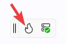

## Hot Design® Agent

**New in Uno Platform Studio 2.0 is the Hot Design® Agent**. An AI-powered assistant that enables rapid UX/UI creation and enhancement within your application. It leverages data contexts and live previews to help developers design, refine, and interact with user interfaces in real time, using deep knowledge of Uno Platform and your running app to simplify cross-platform .NET design.

To get started with **Hot Design® Agent**, jump to the [Hot Design® Agent](xref:Uno.HotDesign.Agent) page.

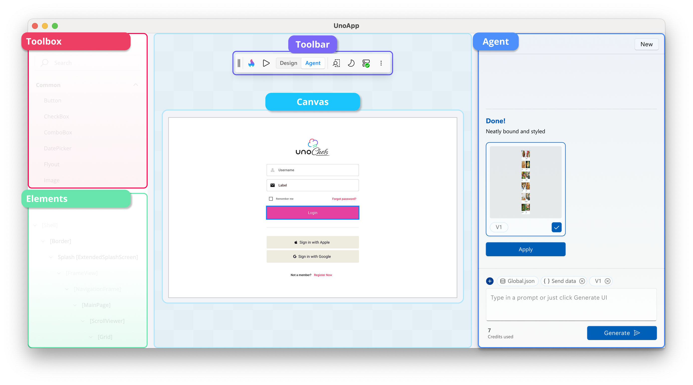

## Hot Design® Core Tool Panels

Once in Hot Design, your running app becomes an interactive canvas.
Hot Design offers an intuitive interface for designing and interacting with your app. This enables you to seamlessly create, edit, and refine your app's user interface in real-time, streamlining the design process for maximum efficiency and simplicity.

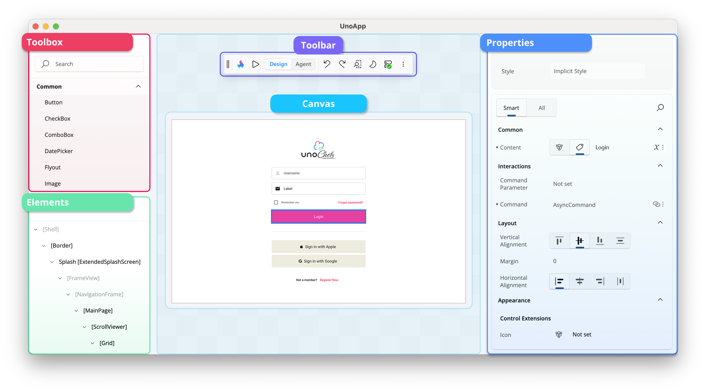

Here are the tool panels available on the interactive canvas:

### Toolbox

On the upper-left side, the **[Toolbox](xref:Uno.HotDesign.Toolbox)** panel provides a categorized list of available controls you can use in your application, including custom and third-party UI controls. It features a search bar for quickly finding specific controls, which you can drag and drop directly onto the canvas or the **[Elements](xref:Uno.HotDesign.Elements)** panel for easy integration into your design.

[➜ Learn more about the Toolbox panel](xref:Uno.HotDesign.Toolbox)

### Elements

Below the **[Toolbox](xref:Uno.HotDesign.Toolbox)**, the **[Elements](xref:Uno.HotDesign.Elements)** panel displays the hierarchical structure of your app. It represents the visual tree of your app, allowing you to select and organize elements. Clicking on an element in this panel highlights it on the canvas for detailed modifications.

[➜ Learn more about the Elements panel](xref:Uno.HotDesign.Elements)

### Canvas

The main **[Canvas](xref:Uno.HotDesign.Canvas)** in the center of the interface represents your running app. It is an interactive area where you can visually design and interact with the user interface. You can select controls, see their outlines, and preview any changes made to the layout or properties.

[➜ Learn more about the interactive Canvas](xref:Uno.HotDesign.Canvas)

### Properties

The **[Properties](xref:Uno.HotDesign.Properties)** panel, located on the right side of the interactive canvas, displays the attributes of the currently selected element on the canvas. By default, it highlights **Smart** properties, prioritizing the most commonly adjusted settings for the element. If you need access to all available properties, you can switch to the **All** view.

This panel also allows you to search for specific properties and make adjustments directly, such as modifying styles, layouts, appearances, data bindings, resources, responsiveness, and interactions, to customize your UI elements effectively.

[➜ Learn more about the Properties panel](xref:Uno.HotDesign.Properties)

### Toolbar

  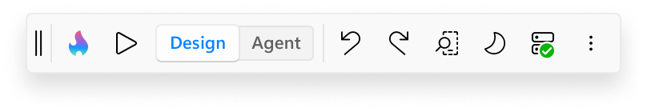

Located at the top of the interactive canvas, the **Toolbar** streamlines your design workflow by providing quick access to essential actions and tools, such as:

- 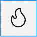  Entering **Hot Design** mode.

- 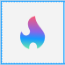  Leaving **Hot Design** mode.

-   Toggling between **Design** and **Agent** mode.

- 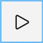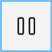  Playing with the live running app to test functionality and pausing to return to adjusting properties, layout, and other design aspects without leaving the interactive designer.

- 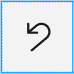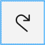   Undoing and redoing changes.

- 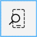  Changing the form factor of the app to test different screen sizes.

- 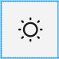   Switching between light and dark themes.

- 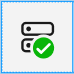  Viewing the connection status and the latest updates from **Hot Reload**.

- 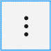  More options, including showing or hiding the various tool panels, providing flexibility in customizing your design workspace.

[➜ Learn more about the Toolbar](xref:Uno.HotDesign.Toolbar)

## Using Hot Design

### Selecting Elements

You can select controls on the app's current screen by simply clicking on them. A visual adorner (blue border) appears around the selected elements, clearly indicating their boundaries. The type, height, and width of the selected element are displayed below the adorner for easy reference.

  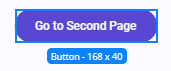

You can also click on controls in the **Elements** panel. This provides an alternative to clicking directly on the canvas, making it easier to precisely select small elements or their containers.

To select multiple elements, hold down the `Ctrl` key while clicking. This enables you to view and edit shared properties in the **Properties** panel.

  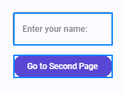

### Placing and Deleting Elements

You can add controls to your app by dragging them from the **Toolbox** onto the canvas, or directly into the **Elements** panel to position them within a specific hierarchy.

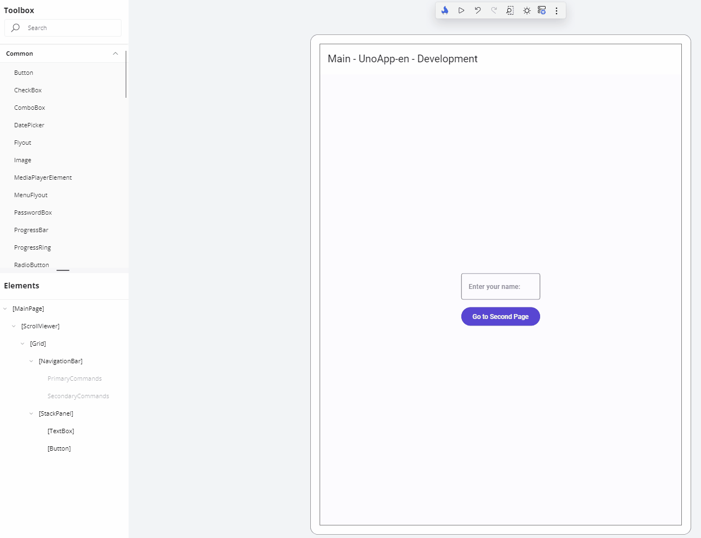

To delete a control, right-click on it either in the canvas or the **Elements** panel and select the delete option.

  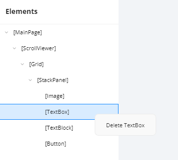

### Setting Properties

The **Properties** panel displays the current values of a control's properties, which you can modify in several ways. Examples include:

- **Changing a property value**, such as the **Text** property of a `TextBlock` control:

    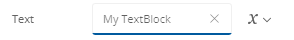

- **Adjusting the alignment** of a control:

    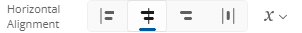

- **Using the autosuggest box** to set a property, such as the **Background** property of a control:

    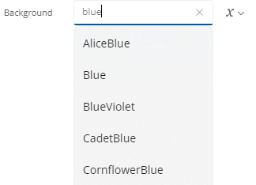

To the right of each property value is the **Advanced** button, which provides information on how the value is defined. For example:

- 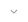 indicates that nothing is set.
- 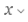 indicates a **Literal**/**XAML** value is set.
- 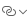 indicates a **Binding** is set.
- 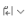 indicates a **Resource** is set.
- 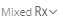 indicates **Mixed Responsive** values are set using the Responsive Extension.

Clicking the **Advanced** button opens a flyout with three settings for each property: **Value**, **Binding**, or **Resource**.

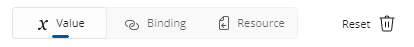

> [!TIP]
> To quickly clear a property's value, click the **Reset** button. Cleared properties behave as though they weren't specified in the original XAML file.

If a property is not set, it will appear similar to this:

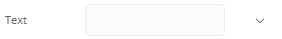

### Changing the Form Factor

The **Toolbar** provides the ability to change the form factor of your app within Hot Design, represented by the following icon:

The height and width of your running app will dynamically adjust to match the selected form factor. You can also specify a custom height and width for precise testing.

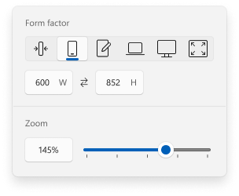

At the bottom of the flyout, you can view and adjust the current zoom level. Modifying this setting dynamically scales Hot Design's view of your app, making it easier to fine-tune your design.

### Toggling Theme

The **Toolbar** includes a feature to toggle between your app's light and dark themes. This also updates the Hot Design layout to match the selected theme. Use this feature to validate your app's theme-sensitive styles and ensure proper responsiveness to theme changes.

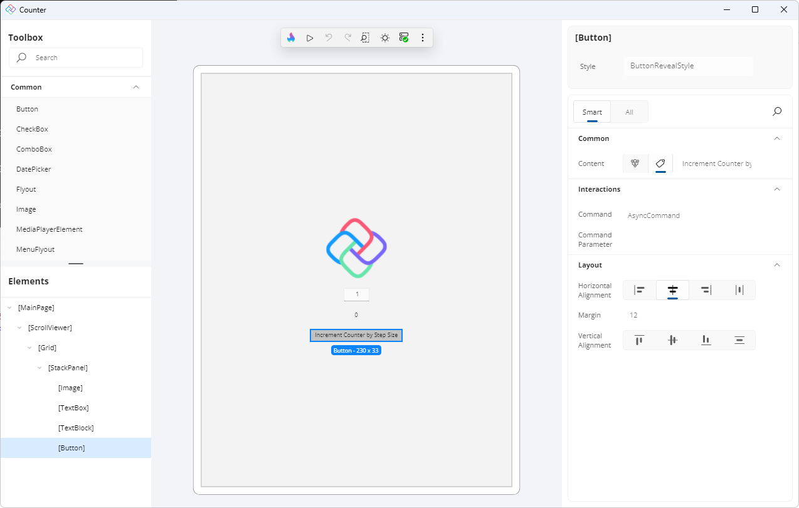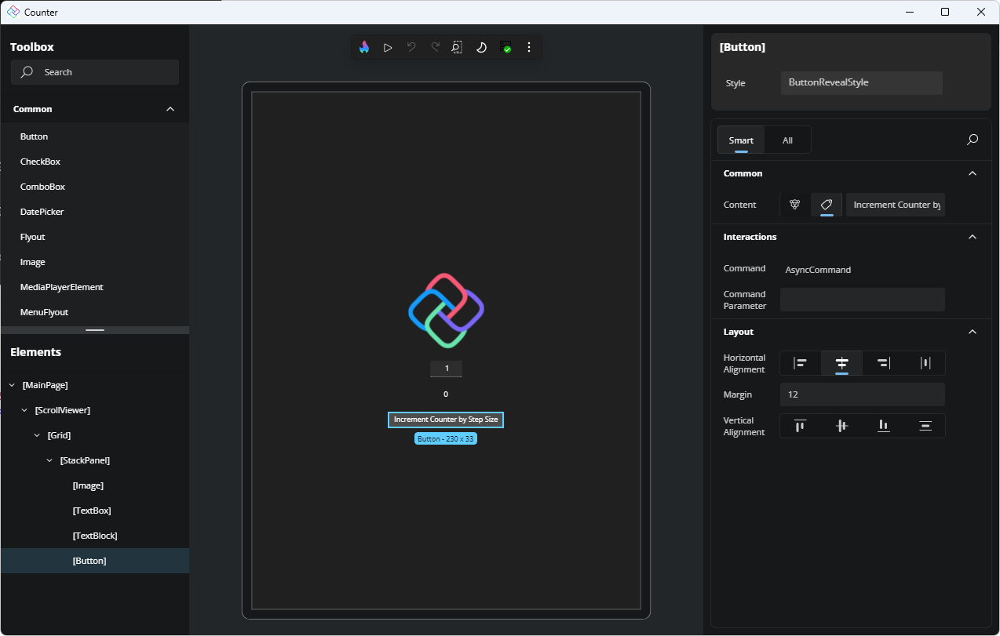

### Interacting with the Canvas

You can interact with the canvas using standard design-surface navigation shortcuts that let you zoom, pan, and scroll while working in Hot Design.

For a complete reference of all keyboard and mouse shortcuts, see [Hot Design Shortcuts](xref:Uno.HotDesign.Shortcuts).

### Next Step

Follow the [Create a Counter App with Hot Design®](xref:Uno.HotDesign.GetStarted.CounterTutorial) step-by-step tutorial on getting started with Hot Design to apply what you’ve learned.
