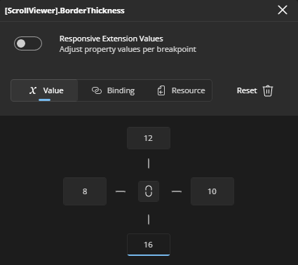
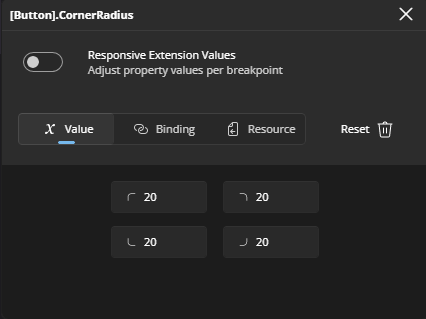

# Advanced Flyout

The **Advanced Flyout** opens when you click the **Advanced** button (three dots) on the right side of a property.

This flyout allows you to define how a property value is set. You can assign a direct **Value**, use a **Binding**, apply a **Resource**, or define responsive behavior using **Responsive Extensions**. In this section, we’ll cover **Value**, **Binding**, and **Resource**. For more on Responsive Extension, [click here](xref:Uno.HotDesign.Properties.AdvancedFlyout.ResponsiveExtensions).

## Value

This is the default way of setting a property value. Depending on the property type, you'll see different editors:

### TextField

For `string`, `int`, `decimal`, or similar types, a simple **TextField** is shown.

### Thickness and Corner Radius Editor

For layout-related properties like `Padding`, `Margin`, `BorderThickness`, and `CornerRadius`, clicking the three-dot **more options** button next to the property opens a flyout with specialized editors.

- **Thickness Editor:** Allows setting individual values for Left, Top, Right, and Bottom. By default, a single field sets all sides equally. Click the center button once to enable the top text field - one for horizontal (left and right) and one for vertical (top and bottom). Clicking the button again enables the four fields, letting you set individual values for Left, Top, Right, and Bottom.

- **Corner Radius Editor:** Similar to the Thickness Editor, it displays four text fields, each with an icon indicating which corner (TopLeft, TopRight, BottomRight, BottomLeft) the field corresponds to. All fields are enabled by default, so you can enter values for each corner immediately.

## Grid Column & Row Editors

When you open the advanced flyout on a `ColumnDefinitions` or `RowDefinitions` property, you get a full table editor. Here’s what you can do:

- **Reorder**  
  Drag the ⋮⋮ handle to change the order of your rows/columns.

- **Min / Size / Max**  
  - **Min**: minimum pixel size  
  - **Size**: choose between `Auto`, a fixed pixel value, or `*` (star) for weighted sizing  
  - **Max**: maximum pixel size  

- **Add / Remove**  
  - Click **+** to insert a new definition below the current row  
  - Click **–** to delete the current definition  
  (the delete button is disabled once only one definition remains)

## Binding

Binding allows for a dynamic data connection between your UI and data source. Here's a breakdown of the fields available:

- **Type**: Choose the type of binding:
  - `Binding`: Standard runtime binding.
  - `x:Bind`: Compile-time binding with better performance and error checking.
  - `AncestorBinding`: Binds to a parent element in the visual tree.
  - `ItemsControlBinding`: Used for bindings inside item templates.

- **Path**: Define the property path within your DataContext. You can either type it manually or select one from the dropdown list of available properties.

- **Mode**: Select how the binding flows:
  - `OneTime`: Sets the value once.
  - `OneWay`: Updates the UI when the source changes.
  - `TwoWay`: Syncs changes both ways between UI and source.

### Advanced

- **Converter**: Select a value converter from your app. The list will show available converter classes defined in your project. Converters are used to transform the data between the source and the UI. To see the available options, start typing a converter name and it will be listed.

- **Converter Parameter**: An optional extra input for the converter. This lets you pass additional information to adjust how the conversion works. For instance, you might use it to pass a format string or a multiplier.

- **Converter Language**: Sets the language (culture) used by the converter. This can affect things like number formatting or date parsing. For example, using `en-US` will format the number `1234.56` as `1,234.56`, while `de-DE` would format it as `1.234,56`.

- **Element Name**: Binds the property to another UI element on the page by its `x:Name`. This is helpful when you want to reference values from sibling controls.

- **Fallback Value**: The value to use if the binding fails or the source is missing.

- **Target Null Value**: The value to use when the binding result is `null`.

- **Update Source Trigger**: Controls when the data flows from the UI back to the source. For example, it can be set to update immediately on change or only after focus is lost.

## Resource

This option lets you apply a `StaticResource` or `ThemeResource` from your app. It's especially useful for brushes or predefined values, for example.

When focused, the input will suggest available resources. Just click on one to assign it to the property.

## Next Steps

- **[Different Editors](xref:Uno.HotDesign.Properties.Editors)**

  The Properties panel automatically selects the editor best suited for each property’s data type. Visit this page to explore all available editor types and when to use them.

- **[Template Editor](xref:Uno.HotDesign.Properties.TemplateEditor)**

  The **Template Editor** provides a visual canvas for creating and customizing control templates, enabling you to design complex UI structures without hand-coding XAML.

- **[Responsive Extensions](xref:Uno.HotDesign.Properties.AdvancedFlyout.ResponsiveExtensions)**

  **Responsive Extensions** let you define multiple values for a single property based on the screen size or form factor, ensuring your UI adapts seamlessly across devices.

- **[Counter App Tutorial](xref:Uno.HotDesign.GetStarted.CounterTutorial)**

  A hands-on walkthrough for building the [Counter App](xref:Uno.Workshop.Counter) using **Hot Design**, showcasing its features and workflow in action.
