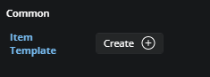
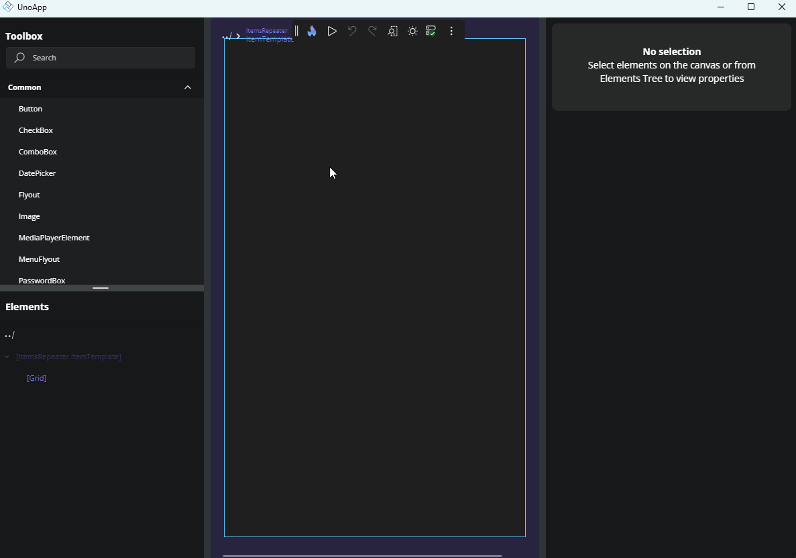

# Template Editor

## Entering the Template Editor

For properties that accept a template-like `ItemTemplate` in an `ItemsRepeater`, or `ContentTemplate` in a `ContentControl` - you can use the **Template Editor** to visually build and customize the template content.

To open the Template Editor, click the **Create** button next to the property in the Properties panel. If a template already exists, the button will say **Edit** instead. Clicking it takes you into the dedicated template editing area.

> [!TIP]
> To edit an element *inside* a drawn template, you do not have to open the template first — just
> **click that element on the canvas**. The click opens the template's scope on the way and selects
> the element you clicked. Opening the template itself, as below, is what you need when the template
> has drawn nothing yet — an empty list, or a `ContentTemplate` on a control with no content.

You can also reach a template without going through the Properties panel:

- **Right-click** an element inside the template and choose **Edit \[\<template property>]**.
- Pick the template from the [Scope Selector](xref:Uno.HotDesign.ScopeSelector) tree.

> [!NOTE]
> The **Create** / **Edit** button is disabled when the property's value is a template *selector* — there is no single template to open. Navigate to the individual branch you want from the Scope Selector, where a selector property groups its template branches beneath it.

### Real Data, Not an Empty Shell

A `DataTemplate` used by a list with items is opened **bound to one of the real items**, so you are designing against the data your app actually has rather than an empty placeholder.

## Using the Template Editor

The template editor opens a separate canvas where you can design and preview the structure of your template without affecting the rest of the UI.

From here, you can:

- Drag and drop elements from the **Toolbox** into the **Tree view** or directly onto the **Canvas**.
- Build the visual structure using standard controls and layout containers.
- Bind UI elements to data by selecting a control, opening the **Advanced Flyout** for a property, and choosing from the available bindings based on the template's `DataContext`.

  If your control already has a data source (e.g., an `ItemsRepeater` bound to a list), those data properties will be accessible within the template for binding.

In the **Elements** panel the template itself appears as a **template root** node, labelled `[OwnerType].PropertyName` — for example `[ListView].ItemTemplate`. It is a container rather than a selection: its children are the elements you edit. An *empty* template root accepts a drop from the Toolbox, as its single child.

### Using x:Bind Inside a Template

To author compiled bindings inside a template, its `x:DataType` has to be set. Select the template root node and set it from the **Identity** category using its **Set data type…** field. Until it is set, the binding editor's path picker shows a **Missing x:DataType for DataTemplate** notice instead of the member list. See [x:DataType](xref:Uno.HotDesign.Properties.Editors#xdatatype).

### Sizing the Template Surface

A template opens at the size it renders at in its list — the size of the element being designed — rather than at a page size. When that size cannot be determined, the surface falls back to a size derived from the parent list control's dimensions and orientation. Content that stretches to fill its place in the list — for example, an item that fills the width of a vertical list — fills the editing surface the same way, while keeping its own item height.

To set an exact size, open the **Zoom/Size** flyout from the toolbar: while editing a template it offers **Width** and **Height** inputs (and Zoom), so you can size the editing surface precisely. Device form-factor presets and the *Window size* / *Canvas size* shortcuts are not shown here, because a fixed device or window size is not meaningful for a template.

Opening the flyout does not resize the template — only a Width/Height value you enter changes it, and that change applies to the current editing session. Reopening the template (or opening it again in a later session) resolves its size from the template again rather than restoring a size you previously set.

### Leaving the Template Editor

To exit the template editor and return to the main layout:

- Click the **Back** icon at the top-left of the Canvas area, or

- Use the **Back** icon in the top-left of the Tree view, or

- **Double-click** an area outside the template's content on the canvas.

Once you return, the control's template will be updated with your changes, and you'll see them reflected in the main design view. The element the template belonged to becomes the selection, and **every instance rendered from that template** picks up your changes — not just the one you were looking at.

This includes templates that are shared. If the template is defined in a resource dictionary and used by controls on more than one page, every page currently loaded in the running app is rebuilt from the edited template, not only the page you opened the editor from. Controls bound to a *different* template are left untouched.

> [!NOTE]
> Rebuilding a page from the edited template re-creates it, so anything transient that page was holding — scroll position, an in-progress selection, unsaved state in an input control — is reset. This applies to each page that uses the template you edited.

Leaving a template also restores the canvas settings of the context you return to: the page-level width, height, zoom, and auto-fit come back rather than the template's own dimensions.

> [!NOTE]
> Each editor you drill into is pushed onto a stack, so you can nest a `UserControl` editor inside a template editor and unwind back the way you came. **Application** mode and **Previews** mode keep separate stacks — drilling into a template in one does not affect the other.

## Next Steps

- **[Different Editors](xref:Uno.HotDesign.Properties.Editors)**

  The Properties panel automatically selects the editor best suited for each property’s data type. Visit this page to explore all available editor types and when to use them.

- **[Advanced Flyout Editor](xref:Uno.HotDesign.Properties.AdvancedFlyout)**

  Use the **Advanced Flyout** to choose how a property value is provided: enter a literal **Value**, set up a **Binding**, reference a **Resource**, or apply **Responsive Extensions** for adaptive layouts.

- **[Responsive Extensions](xref:Uno.HotDesign.Properties.AdvancedFlyout.ResponsiveExtensions)**

  **Responsive Extensions** let you define multiple values for a single property based on screen size or form factor, ensuring your UI adapts seamlessly across devices.

- **[Counter App Tutorial](xref:Uno.HotDesign.GetStarted.CounterTutorial)**

  A hands-on walkthrough for building the [Counter App](xref:Uno.Workshop.Counter) using **Hot Design**, showcasing its features and workflow in action.
